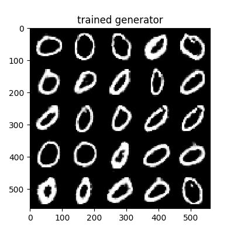
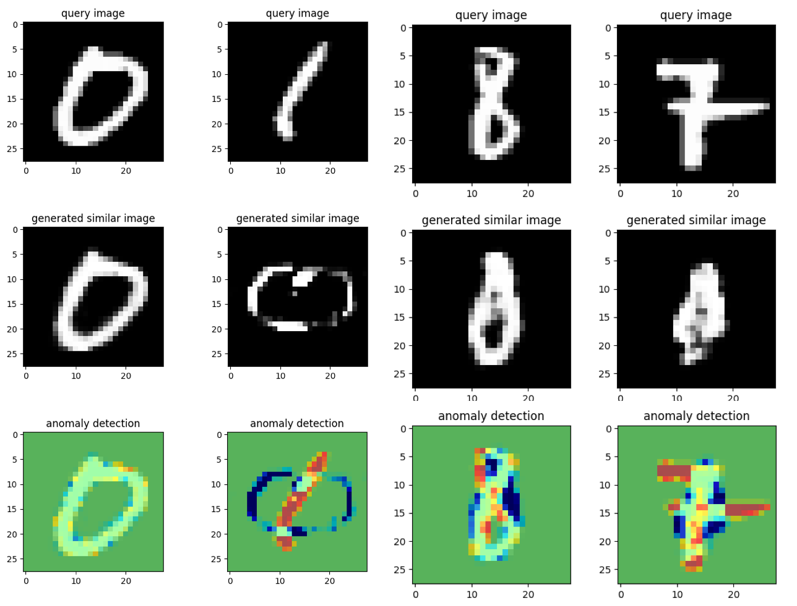

# ANOGAN 

AnoGAN(anomaly GAN)
GANを用いた異常検知

Unsupervised Anomaly Detection with Generative Adversarial Networks to Guide Marker Discovery
https://arxiv.org/abs/1703.05921

# result
### generate image





# code
以下コードの説明です

## main.py
```
usage: main.py [-h] [--datapath DATAPATH] [--epoch EPOCH]
               [--batchsize BATCHSIZE] [--mode MODE] [--imgsize IMGSIZE]
               [--channels CHANNELS] [--zdims ZDIMS] [--testpath TESTPATH]
               [--label_idx LABEL_IDX] [--img_idx IMG_IDX]

train AnoGAN

optional arguments:
  -h, --help            show this help message and exit
  --datapath DATAPATH, -d DATAPATH
  --epoch EPOCH, -e EPOCH
  --batchsize BATCHSIZE, -b BATCHSIZE
  --mode MODE, -m MODE  train, test
  --imgsize IMGSIZE
  --channels CHANNELS
  --zdims ZDIMS
  --testpath TESTPATH, -p TESTPATH
  --label_idx LABEL_IDX
  --img_idx IMG_IDX

```

## dcgan.py
DCGANを構築し，学習を行うクラス
mainから呼び出し

## load.py
MNISTや画像データ・CSVデータを読み込むスクリプト
mainから呼び出し

## model.py
mainから呼び出し

# model

### Dsicriminator

### Generator

# Requirement

- Software
    - python3.6.3
    - tensorflow==1.7.0
    - keras==2.1.5
    - numpy==1.14.0
    - matplotlib==2.2.2
    - opencv-python==3.4.1.15

# reference

https://github.com/tkwoo/anogan-keras
https://www.renom.jp/ja/notebooks/tutorial/generative-model/anoGAN/notebook.html